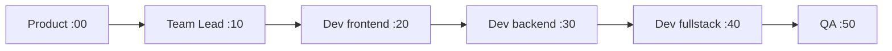

# AI-Army Architecture

## Pipeline Overview

The pipeline runs sequentially: **Product → Team Lead → Dev (frontend/backend/fullstack) → QA**. Each crew runs at staggered minutes within the hour to avoid blocking.

## Crew Roles and Outputs

| Crew | Role | Label Flow | Tools |
|------|------|------------|-------|
| **Product** | PM + Product Agent | backlog → prioritized → ready-for-breakdown | ListOpenIssues, CreateStructuredIssue, EnrichIssue, UpdateIssue |
| **Team Lead** | Break down features | ready-for-breakdown → broken-down sub-issues | ListOpenIssues, BreakdownAndCreateSubIssuesTool |
| **Dev** | Frontend, Backend, or Fullstack | picks frontend/backend/fullstack sub-issues, implements, opens PRs | RepoStructure, ListDir, ReadFile, SearchCodebase, WriteFile, ListOpenIssues, CreateLocalBranch, GitCommit, GitPush, CreatePullRequest, UpdateIssue |
| **QA** | Review and merge | reviews PRs, merges, sets done | ListPullRequests, ReviewPullRequest |

## Context Flow

Cross-crew memory is stored in [src/ai_army/memory/context_store.py](src/ai_army/memory/context_store.py):

- **Storage:** `.ai_army_context.json` (in `REPO_WORKSPACE` or `.ai_army_workspace`)
- **Keys:** `product`, `team_lead`, `dev`, `qa` (summary strings from each crew)
- **Handoff:** Each crew receives `store.get_summary(exclude=<self>)` and writes back with `store.add(crew_name, result)`

## Scheduler

- **Definition:** [src/ai_army/scheduler/runner.py](src/ai_army/scheduler/runner.py) – cron jobs via APScheduler
- **Implementation:** [src/ai_army/scheduler/jobs.py](src/ai_army/scheduler/jobs.py) – `run_product_crew_job`, `run_team_lead_crew_job`, `run_dev_crew_job(agent_type)`, `run_qa_crew_job`
- **Token check:** Each job runs via `run_if_tokens_available` (skips when API limit reached)
